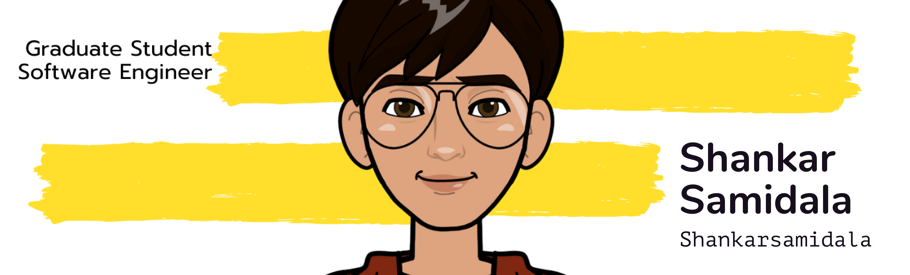

# Hello there! 👋🏻 I am Shankar Samidala! 




I am Shankar Samidala 🙋🏻‍♂️, a Cook,Front End Architect, Web Developer Evangelist & Cloud Computing Consultant. I Spend most of time coding outstanding projects or Designing Architectures.

:mailbox: Reach me out!


[](https://twitter.com/shankarsamidala) [](https://www.linkedin.com/in/samidalashankar/) [](https://www.instagram.com/mr.lazydeveloper/) [](mailto:samidalashankar@gmail.com) 

#### Profile Visits 


<!-- TODO: Add last video link -->

- 🔭 I’m currently working at @Toptal
- :computer: Most used line of code `git commit -m "Initial Commit"`
- 🤔 I’m looking for help with Outstanding Video ideas.
- 📫 How to reach me: samidalashankar@gmail.com.
- 😄 Pronouns: DevOps Guy, Pythonieer.
- ⚡ Fun fact: I play games and go to the GYM very often.

- 💻 I have done 🛫 multiple projects ranging from the field of Devops , Backend to Cloud Computing and   Automation :file_cabinet: .

- 🎯 I am currently brushing up my skills 🚀 and plan to learn Golang and Terraform .

- ⏳ I am willing to work on free-lance projects and love to  contribute to open source projects :bulb:

<!-- * :magnet: You can checkout my projects from here :fire: - [](https://github.com/DiptoChakrabarty/DiptoChakrabarty/blob/master/Projects.md) -->


## Tech Stack :computer:

<br>
<table>
<tbody>
 <tr>

<td align="center" width="20%">
<span><b><center>AWS</center></b></span> 
 
</td>


<td align="center" width="20%">
<span><b><center>GCP</center></b></span> 
 
</td>


<td align="center" width="20%">
<span><b><center>Azure</center></b></span> 
 
</td>


<td align="center" width="20%">
<span><b><center>Docker</center></b></span> 
 
</td>
</tr>

<tr>
<td align="center" width="20%">
<span><b><center>Ansible</center></b></span> 
 
</td>

<td align="center" width="20%">
<span><b><center>Kubernetes</center></b></span> 
 
</td>

<td align="center" width="20%">
<span><b><center>Git</center></b></span> 
 
</td>


<td align="center" width="20%">
<span><b><center>Jenkins</center></b></span> 
 
</td>
</tr>

<tr>

<td align="center" width="20%">
<span><b><center>Django</center></b></span> 
 
</td>

<td align="center" width="20%">
<span><b><center>Linux Administration</center></b></span> 
 
</td>


<td align="center" width="20%">
<span><b><center>Python</center></b></span> 
 
</td>


<td align="center" width="20%">
<span><b><center>MongoDB</center></b></span> 
 
</td>
</tr>

<tr>
<td align="center" width="20%">
<span><b><center>Nginx</center></b></span> 
 
</td>


<td align="center" width="20%">
<!-- <span><b><center>Postgresql</center></b></span>  -->
 
</td>

</tr>

</tbody>
</table>

[](https://github.com/shankarsamidala)

|      Project :octocat:   |     Issues :bug:   | Open PRs :bell:  | Closed PRs :fire:  |
|-------------|-------------------|---|---|
| [**DevTernShip**]() | [](https://github.com/praveenscience/Internship-LMS-FrontEnd/issues) | [](https://github.com/praveenscience/Internship-LMS-FrontEnd/pulls)  | [](https://github.com/praveenscience/Internship-LMS-FrontEnd/pulls?q=is%3Apr+is%3Aclosed)  |
<!-- | [**Hacktoberfest-Project-Ideas**](https://github.com/praveenscience/Hacktoberfest-Project-Ideas/) | [](https://github.com/praveenscience/Hacktoberfest-Project-Ideas/issues) | [](https://github.com/praveenscience/Hacktoberfest-Project-Ideas/pulls)  | [](https://github.com/praveenscience/Hacktoberfest-Project-Ideas/pulls?q=is%3Apr+is%3Aclosed)   | -->


#### Github Stats

|  |  |
| --- | --- |
|  | If you like what I do, support me by buying me a [pizza](https://www.buymeacoffee.com/shankarsamidala) and let's do more useful content! <br /><br /> <a href="https://www.buymeacoffee.com/praveenscience" target="_blank"></a> |


Watch my contribution graph being eaten by a Snake! 🐍


<details>
<summary>
  More stuff about me
</summary>

<br >

I love sharing knowledge and putting tutorials, courses and posts together for helping other developers, and tjat's why Destion exists!

#### What is CoderOne?

<!-- CoderOne is a youtube channel for learning Web/Mobile development, coding and design. Including new technologies and frameworks and anything really related to development world. -->

#### Coding Stats

<!--START_SECTION:waka-->
```text
Python / Django && DevOps  15 hrs 41 mins  ████████████████████▓░░░░   82.29 % 
HTML                       1 hr 50 mins    ██▒░░░░░░░░░░░░░░░░░░░░░░   09.61 % 
Markdown                   1 hr 27 mins    ██░░░░░░░░░░░░░░░░░░░░░░░   07.63 % 
Other                      2 mins          ░░░░░░░░░░░░░░░░░░░░░░░░░   00.25 % 
YAML                       2 mins          ░░░░░░░░░░░░░░░░░░░░░░░░░   00.19 % 
```
<!--END_SECTION:waka-->


</details>
